# Rent the Models. Own the Mind.

*Why the ultimate intelligence should become human augmentation, not another platform*

**Status:** Design thesis and active research direction. Viventium has working components. The decisive closed loop described below is not yet proved.

The complete canonical paper, including its intellectual lineage, lives at [viventium.ai/thesis/rent-the-models-own-the-mind](https://www.viventium.ai/thesis/rent-the-models-own-the-mind).

## The thesis

Models supply intelligence. Agent harnesses turn intelligence into action. Both will keep changing.

Viventium is the user-owned exocortex that connects the best available intelligence to What Makes You, then joins that You'ified AI with You. It lives with your authorized life, acts within your authority, learns from real outcomes, and must survive model and harness changes.

The goal is AUI: **Artificial Ultimate Intelligence**, the ultimate ceiling of intelligence beyond AGI and ASI.

Viventium is not AUI. It is how a human rides the strongest available intelligence at every stage toward AUI without surrendering the accumulated mind formed around their life.

## The semantic model

> **Viventium = You'ified AI + You.**

**AUI** is the intelligence horizon. It is not AI plus a person.

**You'ified AI** is the best available intelligence made:

1. **Connected** to the parts of life the user explicitly authorizes.
2. **Synchronized** with the user's changing priorities, relationships, history and current truth.
3. **Always there**, meaning available to wake on authorized events, not always recording, always speaking or holding unlimited authority.

**You** remain the living source of values, taste, relationships, consequence and final authority.

Viventium is not a second person and not a clone waiting to replace the user. It is the closest achievable version of a flawless you, built as an intelligence you can inhabit and ride. "Flawless" is a direction, not a claim of infallibility.

## Why ownership matters

The closer an intelligence gets to your life, the less acceptable it becomes for a platform to own its continuity.

Viventium's durable state, corrections, permissions and learned behaviour should be inspectable, correctable, exportable, forkable, restorable and deletable. Frontier models can still be rented whenever they produce the best result.

Local ownership does not mean pretending a laptop always beats a frontier data centre. It means separating the intelligence you rent from the mind you own.

**Rent the models. Own the mind.**

## Memory is table stakes

Memory, retrieval, voice, personality and agent orchestration are required. They are not the thesis and they are not a moat.

A system can remember every goal you stated while doing nothing when you abandon it. It can reproduce your preferences while reinforcing your worst habits. It can know your history while learning nothing from the consequences of its own advice.

Viventium has to close a harder loop:

1. Detect where reality is diverging from the user's intent.
2. Activate or create the appropriate specialized cortex.
3. Intervene inside authority the system has earned.
4. Observe what actually happened.
5. Retain, change or kill the behaviour.
6. Handle the next recurrence better, even after the underlying model changes.

The intended learning unit is the human and their owned exocortex operating together.

## What exists now

The current Viventium repository contains working organs of the idea, including:

- a primary foreground agent and specialized background cortices
- persistent memory, recall and scheduled routines
- voice, Telegram and connected-account surfaces
- delegated background work through GlassHive
- emotional control state with decay
- local state, restore paths and controlled self-modification

These components make the thesis buildable. They do not prove continuous human improvement.

## What would count as proof

Viventium must repeatedly:

1. discover something consequential the user would have missed
2. intervene without waiting for the initiating prompt
3. improve a real decision, behaviour or outcome
4. learn from the observed result
5. handle the next recurrence better
6. preserve that learning through model or harness replacement

It must remove more cognitive burden than it creates. Greater authority must be earned through demonstrated reliability and remain revocable.

If it only remembers, chats, appears alive or routes tasks to another agent, it is a wrapper.

## The moat, if earned

The user's moat is the life-shaped intelligence produced through years of decisions, corrections, interventions and consequences. Another system can import files and use the same model. It cannot manufacture the history through which an intelligence learned when to act, challenge, ask or remain silent for one particular human.

Viventium's moat is not lock-in. If the user cannot export the accumulated mind, the product has betrayed the thesis.

The hard-to-copy capability is learning from lived outcomes better than alternatives while keeping the accumulated mind portable and the human in control.

## Build principles

1. **Make the model replaceable.** Every frontier breakthrough should strengthen Viventium rather than obsolete it.
2. **Keep authority explicit and revocable.** Always available is not unlimited permission.
3. **Separate observation from evidence.** A plausible agent explanation is not proof that an intervention worked.
4. **Measure burden, not only task completion.** An exocortex that creates supervision work has failed even if its agents stay busy.
5. **Preserve authorship through change.** The system may challenge the user, but it may not silently redefine the user's values.
6. **Never confuse aliveness with value.** Voice, emotional state and ambient presence matter only when they improve agency or trust.
7. **Prefer portability over lock-in.** The life-shaped mind should survive providers, models, harnesses and product changes.

## Direction

First, prove that one human can continuously improve through Viventium.

Then use the same foundation to augment other humans without flattening their differences. Later, that foundation can support a Human, Character, Clone and Mind Design Lab.

The interface may move from screens to voice, ambient presence, glasses, biological interfaces and neural interfaces. The interface is not the destination.

The destination is the human riding the greatest intelligence available without disappearing inside it.

**The most powerful intelligence in your life should belong to you.**

## Author

Written by [Adrien Beyk](https://www.linkedin.com/in/adrienbeyk/), founder of Viventium.

## Intellectual lineage

- J.C.R. Licklider, ["Man-Computer Symbiosis"](https://groups.csail.mit.edu/medg/people/psz/Licklider.html), 1960.
- Douglas Engelbart, ["Augmenting Human Intellect: A Conceptual Framework"](https://www.dougengelbart.org/content/view/138/), 1962.
- Andy Clark and David Chalmers, ["The Extended Mind"](https://academic.oup.com/analysis/article-abstract/58/1/7/153111), 1998.
- David Silver and Richard S. Sutton, ["Welcome to the Era of Experience"](https://storage.googleapis.com/deepmind-media/Era-of-Experience%20/The%20Era%20of%20Experience%20Paper.pdf), 2025.
