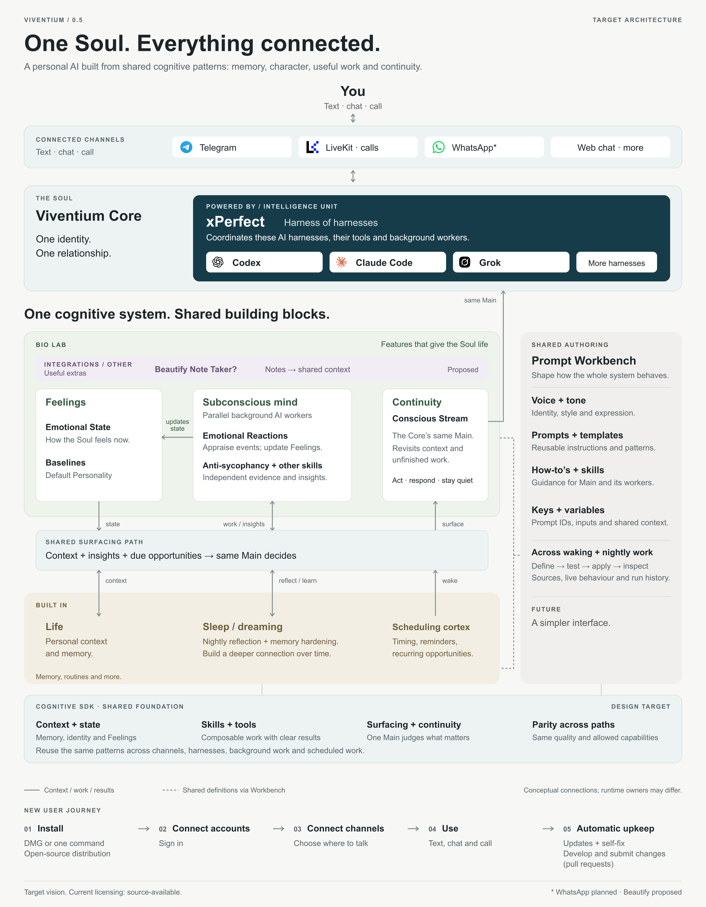

# Viventium cognitive-system vision

**Status: approved product vision. Accepted by the product owner on 2026-09-29.**

This is the source of truth for Viventium's high-level product definition, grouping, and cognitive
relationships. It takes precedence over earlier V0.5 vision and architecture proposals. The diagrams
below are part of this contract. Detailed feature owners define behavior and acceptance; the
[runtime overview](overview.md) and [QA catalog](../../qa/catalog.yaml) describe current implementation
and its evidence. Approval of this vision does not claim that every design target is shipped.

## One Soul. Everything connected.

The user faces one **Soul**: Viventium Core. Channels lead into the same identity and relationship.
The Core is powered by **xPerfect**, the intelligence unit and harness of harnesses. Its harnesses
include Codex, Claude Code, Grok, and future harnesses. The diagram places channels in one horizontal
row, then the Core, then its connected cognitive system, so the page reads in that order.

<picture>
  <source media="(prefers-color-scheme: dark)" srcset="assets/cognitive-system/viventium-0.5-dark.png">
  
</picture>

Open the full diagram: [light SVG](assets/cognitive-system/viventium-0.5-light.svg) ·
[dark SVG](assets/cognitive-system/viventium-0.5-dark.svg) ·
[light PNG](assets/cognitive-system/viventium-0.5-light.png) ·
[dark PNG](assets/cognitive-system/viventium-0.5-dark.png).
[Artwork sources](assets/cognitive-system/README.md).

## The grouping is the contract

| Layer | Role |
| --- | --- |
| **Channels** | Telegram, LiveKit calls, WhatsApp, web chat, and future surfaces reach the same Soul. |
| **Viventium Core / Soul** | One identity, one relationship, and one Main that owns user-facing judgment. |
| **xPerfect** | The Core's intelligence unit: a harness of harnesses with shared context and capable execution. |
| **Bio Lab** | Feelings, Subconscious, Continuity / Conscious Stream, and optional integrations that give the system life. |
| **Built-in wiring** | Life, Sleep / Dreaming, and Scheduling Cortex are part of the system's normal operation. |
| **Prompt Workbench** | Shared definitions for voice, tone, prompts, templates, how-to's, skills, keys, and variables; inspect, test, and apply them across waking and nightly work. A simpler future interface remains the goal. |
| **Cognitive system / SDK foundation** | Shared context and state, skills and tools, surfacing and continuity, with parity across paths. These are reusable building blocks, not isolated feature silos. |

### Bio Lab and the shared surfacing path

- **Feelings** includes Emotional State plus Baselines / Default Personality. It holds state that
  informs the Soul's behavior.
- **Emotional Reactions** belongs to the **Subconscious**. Reactions update Feelings. Background AI
  agents or workers also execute skills such as anti-sycophancy, reflection, and insight generation.
- **Continuity / Conscious Stream** is the Core's same Main staying aware over time. It decides
  whether to act, respond, or stay quiet; it is not a separate competing speaker.
- Background work, emotional state, Life context, nightly learning, and scheduled wakes use a
  **shared surfacing path** to reach the conscious Main. Their roles differ, but their building
  blocks and quality contract stay aligned.
- **Integrations / Other**, including the proposed Beautify note taker, extends this system.

### Built-in wiring and Workbench

**Life** supplies context. **Sleep / Dreaming** runs nightly reflection and memory hardening to
build a deeper connection over time. It connects with Subconscious work, Continuity, and Workbench
through shared context, learning, surfacing, and definitions. **Scheduling Cortex** provides wakes
and follow-through through the same path into Continuity.

**Prompt Workbench** spans the cognitive features and these routines. Voice, tone, prompt templates,
how-to's, skills, prompt keys / IDs, variables, and shared context must have visible definitions and
traceable live behavior. Provider credentials remain protected configuration; the diagram's prompt
keys and variables do not make credentials part of a prompt. Workbench supports defining, testing,
applying, and inspecting behavior and run history.

The arrows show conceptual relationships, not a claim that every module shares one runtime queue
or database. Solid connections carry context, work, or results. Dashed connections show shared
definitions. Across harnesses, channels, and background paths, parity means the same quality and
allowed capabilities, subject to each surface's real limits.

## New-user journey

1. **Install** with a DMG or one command. Open-source distribution is the target.
2. **Connect an account / log in.**
3. **Connect channels.**
4. **Use it:** text, chat, or call the same Soul.
5. **Automatic upkeep:** updates, self-fix, and development that submits a PR within authorized
   boundaries.

The experience should remain simple and clear. Internal architecture must not make the user
coordinate the system.

## Target and current delivery

The diagrams define the direction. WhatsApp is **planned**; Beautify is **proposed**. The DMG,
open-source distribution, and automatic upkeep are design targets, not release claims. Current
licensing is **source-available**, as specified in [LICENSE](../../LICENSE). Current install and
release support belongs to [runtime, install, and release](../requirements_and_learnings/capabilities/runtime-install-release.md).

For changes, use this vision with the [key principles](../requirements_and_learnings/01_Key_Principles.md)
and the [owning feature contract](../README.md#capabilities-and-acceptance). Earlier V0.5 proposals remain
useful exploration; they cannot override this approved definition or approve unrelated UI,
licensing, implementation, or release decisions.
