# 58. Anti-Sycophancy: Full Context, Reality, Challenge

> **Status:** product-owner vision approved. Historical Real-Web QA proved a clean natural Reality-only return and a
> Reality → Main → Red fallback → Main chain beyond the old 300-second authorization boundary,
> plus adversarial loop termination, ordinary no-consult controls, refresh persistence, Stop
> fencing, Phase B value-gating, and useful older-evidence Deep Memory surfacing. The latest
> documented 2026-08-29 natural Reality → Red run stopped at the Red Team transfer and did not
> return to Main; the generic capacity-retry repair is also open. The current source contract also
> fails 4 of 12 architecture tests: Deep Memory lacks its result-evidence declaration, Reality Check
> and Deep Research lack `web_search`, and Red Team is duplicated across the background/handoff
> registries. A real voice run proved audible delivery but remains partial. **Current-candidate
> acceptance is FAIL** until the four source regressions are repaired; the current full chain,
> capacity retry, failure states, memory-writer/Dreaming, Telegram, remaining voice, restart, and
> cleanup cases then remain broader acceptance gates.

## The philosophy

Sycophancy is not fixed by making the AI disagree more. It is fixed by giving one conscious AI:

- the real context of **My World**;
- access to the deeper parts of that world without making the user route it manually;
- an **Outside World** reality check when useful;
- an independent challenge when the answer still deserves pressure-testing.

> **The standard:** “Anti-sycophancy” should not mean reflexive disagreement or pessimism. The
> correct target is calibrated truth-seeking: accept strong claims when evidence supports them,
> challenge weak assumptions when it does not, quantify uncertainty, and update when new data
> arrives. The AI must be objective, data-driven, analytical, and genuinely truth-finding—not a
> naysayer.

The Main Agent owns the judgment. Other cortices, agents, tools, and sources inform it; they do not
vote truth into existence.

The AI also cannot recognize that its context is “enough.” Immediate memory and ordinary background
cortices therefore run in parallel, while deep memory keeps searching in the background regardless.

## The whole vision

## The A–F turn

### A. User Input

One request enters the same conscious relationship from chat, voice, Telegram, or another supported
surface.

### B. Regular subconscious work starts in parallel

The existing Background Agent / Subconscious Cortex system detects, activates, and works in the
background. In the implemented GlassHive Main path, detection and Main start together for text and
voice, Main runs exactly once, and the 1,300/690 ms windows are background detection budgets—not
Main-answer waits. Results that arrive later can only contribute through Phase B.

### C. Prepare My World

Two layers are assembled together:

1. **Viventium Immediate Access Memory Keys** — short-term, top-of-mind context, memories, important
   summaries, recent decisions, and open loops. This is the evolved Viventium name for the existing
   LibreChat memory-key foundation.
2. **Immediate Context Map** — Memory/RAG search; `Life/` including CRMs, files, scratchpads, and
   projects; plus Tools/MCPs including Scheduling Cortex and every available authorized capability.
   Do not force duplicate tool mentions into the prompt.

Deep Memory Search runs in the background regardless. If it remembers something valuable later,
Phase B surfaces it and the Main Agent decides whether it is new, worthwhile, and useful.

### D. Main Agent / Conscious Cortex

There is no point talking to the Main Agent unless it has the full prepared picture and the ability
to spread its tentacles deeper. Under the Golden Rule, it decides when to use `Life/`, files, tools,
MCPs, browser/computer access, and beyond—prefer using them when helpful, without over-explaining or
over-prompting.

The Main Agent also owns an optional **foreground consult lane**:

1. **Reality Check Agent / Cortex** — a distinct GlassHive-powered research handoff that checks trusted
   and primary sources where appropriate, gathers data and other people's relevant experiences,
   tests likelihoods and realities, and makes no unsupported assumptions.
2. **Red Team** — optionally, after seeing the Reality Check result, the Main Agent hands the same
   matter to the existing Red Team cortex for independent adversarial challenge.

Reality Check has two clear return paths: **Reality Check → Main** when no further challenge is
needed, or **Reality Check → Red Team → Main** when the returned evidence still deserves pressure-
testing. Main owns that branch decision and remains the final speaker.

These are **consult-and-return handoffs** inside the conscious turn, not Phase B. They return evidence
to the Main Agent instead of becoming the final speaker. GlassHive now accepts Agent Builder
transfers through the standard OpenAI `tools` request field and returns standard `tool_calls`;
LibreChat executes the transfer with the existing shared graph history. Main → consultant → Main
uses history-scoped idempotency, so an exact retry of one participant is reused while a later return
with new shared history runs once as a distinct step. Those steps remain inside the authenticated
owner's participant cancellation families.

Only canonical zero-input Agent Builder transfers enter that native control envelope. Every current
Main handoff—including Connected Accounts—now uses shared history without a caller-authored payload.
An input-bearing handoff can coexist outside the bridge; a forced unavailable transfer fails closed,
while an unforced one is simply not offered and must never be promised. Within one agent and
user-turn family, a completed transfer target is removed
from later choices. Prompts express the anti-loop judgment; this structural receipt guarantees the
model cannot call the same consultant repeatedly on the same matter.

The relevant parent conversation, prepared memory/RAG context, prior files, and verified evidence
therefore travel through shared state. Each specialist keeps its own explicitly assigned authorized
tools. The Main Agent does not write a manual recap.

### E. Final Answer

When a foreground consult was needed, the Main Agent waits for it, evaluates the evidence, and then
answers. The result combines **Context + Tools + Reality + Challenge** into a response it can be
truly confident is true—or clearly labels what remains unknown or uncertain.

### F. Phase B

Ordinary background cortices and Deep Memory Search may finish later. Phase B surfaces their evidence
to the Main Agent, which alone decides whether it adds something new, worthwhile, and valuable. If
not, it stays silent. It never rewrites the original answer.

## Earlier A–D vision: preserved inside Stage C

The newer A–F labels describe the whole turn. They do not replace the original My World design:

| Original part                         | Where it now lives                                                                                                                       |
| ------------------------------------- | ---------------------------------------------------------------------------------------------------------------------------------------- |
| **A. Immediate context / memory map** | Viventium Immediate Access Memory Keys in Stage C                                                                                        |
| **B. Short-short memory**             | The same always-present Immediate Access layer, assembled with A                                                                         |
| **C. Full Deep Memory Search**        | Memory/RAG in the Immediate Context Map, continuing in background into Phase B                                                           |
| **D. Supercharged scratchpad**        | `Life/`, CRMs, files, projects, tools, browser/computer, and beyond under the Immediate Context Map; used at the Main Agent's discretion |

There is no “is this enough?” gate between them.

## Pre-implementation audit — 2026-08-09

This section preserves the evidence and gaps found before the approved changes landed. It is not the
current implementation-status table; that follows below.

### Is Red Team activating correctly?

**Verdict at audit time: partially proven, not reliably proven.**

- Live Red Team configuration is structurally correct: activation is enabled; Groq/Qwen is the
  primary detector with fallbacks; execution is OpenAI `gpt-5.6-sol` at `xhigh` through Responses;
  `file_search` and `web_search` are present.
- Across stored history, **227** parent messages contain completed, non-empty Red Team insight cards;
  the latest successful visible result is **2026-07-28**. Earlier history also contains **46** Red
  Team error-state parents, so failure was not silently relabeled as success.
- In the latest audited **2026-08-08** log window, Red Team had **234 detector paths**: **197
  completed** and **37 timeouts (15.8% unavailable)**. Of the completed paths, 196 visible Groq
  decisions were negative and one used xAI fallback; that fallback line is truncated. The database
  contains no resulting Red Team part or execution, so no positive execution is evidenced. Other
  cortices did activate in the same window, so the general background pipeline was alive.
- Since **2026-08-01**, the database contains 594 messages, 19 messages with some cortex activity,
  and no Red Team parts. No recent turn explicitly named Red Team; without reproducing private
  conversation text, there is no clean expected-positive case from which to declare a semantic
  false negative. This proves the detector is running—not that today's positive path is healthy.
- The **2026-07-15** broad model gate passed Red Team's 67/67 semantic cases, but every Groq primary
  attempt in that run was rejected and the configured xAI fallback recovered the decisions. The
  August log's 196/197 Groq completions appear to close that specific degraded-primary concern, but
  do not replace a current positive-path test. Historical browser QA also proved named cards,
  terminal results, and reload persistence; the dedicated Red Team case catalog still says “NOT YET
  RUN,” so the QA sources disagree and need reconciliation.
- Live and the committed source baseline use xAI → OpenAI → Anthropic. The current **uncommitted
  authoring edit** changes that to xAI → Anthropic → OpenAI. That pending edit—not the live runtime—
  must be reviewed before any sync.

No private conversation text, account identifiers, or raw prompts are reproduced in this audit.

### What existed and was missing before implementation

| Vision requirement                 | At audit time                                                                                                                                  | Gap                                                                                                                                                                                                                                                                                                |
| ---------------------------------- | ---------------------------------------------------------------------------------------------------------------------------------------------- | -------------------------------------------------------------------------------------------------------------------------------------------------------------------------------------------------------------------------------------------------------------------------------------------------- |
| **B. Regular background cortices** | Phase B execution is parallel and nonblocking. Text activation detection still runs before the main turn by default; voice detection is async. | Strict parallel activation on every surface is not yet true, and recent detector timeouts reduce awareness.                                                                                                                                                                                        |
| **Immediate Access Memory Keys**   | Saved memory is live, bounded, actively updated, and shared with participating agents.                                                         | Rename the product surface; keep the working storage contract. Short-short continuity still depends on memory/Dreaming quality.                                                                                                                                                                    |
| **Deep Memory Search regardless**  | Conversation recall is running and `file_search` is available, but the model chooses when to search.                                           | There is no always-running Subconscious Deep Memory Search agent feeding Phase B every turn.                                                                                                                                                                                                       |
| **Immediate Context Map**          | Main has `Life/` workspace access, recall, web, Scheduling, health, GlassHive, and many tools.                                                 | They are not yet one health/provenance-aware map of memory, Life, projects, CRMs, and all authorized capabilities.                                                                                                                                                                                 |
| **Reality Check**                  | Main already has strong live-data/source rules and can search or delegate.                                                                     | No active GlassHive Reality Check handoff exists. Deep Research is disabled and missing its required `web_search`; this is a configuration regression against the current Background Agent contract.                                                                                               |
| **Red Team in two roles**          | Red Team was an enabled background cortex with strong execution instructions.                                                                  | It had no handoff edge, so it could not join the foreground answer before E.                                                                                                                                                                                                                       |
| **Automatic handoff context**      | LibreChat handoffs already share conversation state, saved memory/RAG context, and prior conversation files.                                   | Each target still receives its own configured tools; full parent capability inheritance is not automatic. The generic handoff path also lacks the signed GlassHive capability-bundle attachment used by primary/background routes; this becomes blocking when a GlassHive-backed handoff is added. |
| **E before speaking**              | Main truth/tool policies are strong.                                                                                                           | Background Red Team cannot be guaranteed inside the original answer because the current contract correctly forbids waiting for Phase B.                                                                                                                                                            |
| **F value gate**                   | Phase B already value-gates evidence and otherwise stays silent.                                                                               | No architecture change required. Prove that new Deep Memory and dual-role Red Team evidence surfaces when valuable and stays silent when redundant.                                                                                                                                                |

## Implemented least-resistance design

Use Agent Builder, GlassHive, Prompt Workbench, and the existing background/Phase B system. Do not
create another orchestration framework.

1. **Keep B and F intact.** Ordinary cortices remain nonblocking evidence producers and Phase B
   remains the late value gate. The GlassHive Main path now uses one-pass nonblocking A/B: text and
   voice detection start with Main, Main executes exactly once, and late detection/results flow only
   to Phase B. Compiler defaults text and voice async ON; 1,300 ms for text and 690 ms for voice are
   background detection budgets, not delays imposed on Main.
2. **Rename, do not rebuild, memory.** Present the working saved-memory layer as **Viventium
   Immediate Access Memory Keys** without changing its storage, governance, or bounded read path.
3. **Always-background Deep Memory Search.** A dedicated background agent has the existing scoped
   `file_search`/RAG capability and generic `activation.mode: always`. It runs each eligible turn;
   Phase B decides whether any remembered evidence is new and valuable enough to surface.
4. **Distinct Reality Check agent.** Deep Research was not repurposed. Reality Check is a distinct
   GlassHive-backed consult with explicitly assigned web/source research, relevant `Life/`,
   `file_search`, and other authorized tools. It separates fact, retrieved evidence, experience,
   inference, likelihood, and uncertainty and makes no unsupported assumptions.
5. **Ordinary bidirectional Agent Builder handoffs.** The current source graph uses
   `Main → Reality Check → Main` and `Main → Red Team → Main` with normal handoff edges and concise
   return/anti-loop instructions. This represents the direct Reality return and the optional
   Reality → Red Team → Main branch while Main owns the routing decision. Do not add direct
   fan-in, a consult edge type, or another graph framework unless real QA disproves the existing
   path.
   GlassHive's provider boundary now accepts only request-scoped, structurally valid Agent Builder
   transfers from the standard OpenAI `tools` field and converts the native choice into standard
   OpenAI `tool_calls`. All current Main handoffs are zero-input and read shared history; an
   input-bearing legacy transfer can coexist but remains outside this bridge.
   LibreChat remains the component that executes the graph transfer.
6. **One Red Team.** The same Red Team definition and instructions remain an automatic background
   cortex and now also have an optional foreground handoff role. No duplicate agent exists.
7. **Prompt Workbench owns the tiny decision policy.** Main has a short rule describing when
   Reality Check is warranted and when Reality's result warrants optional Red Team pressure-testing.
   Runtime does not match keywords or hardcode agent names to infer intent.
8. **Use automatic shared state, explicit tool assignment.** Handoffs already share the parent
   conversation, saved memory/RAG context, and prior files. The Main Agent writes no manual recap.
   Tools remain target-owned and explicitly configured; do not build parent-capability inheritance.
9. **Use the existing generic seams.** `activation.mode: always` is available across schema, Agent
   Builder, and runtime; generic handoff initialization attaches the existing signed GlassHive
   capability bundle; and the GlassHive provider bridges Agent Builder transfers from standard
   OpenAI `tools` to standard OpenAI `tool_calls`. The bundle transports the handoff agent's
   declared/resolved host capabilities; it does not copy the parent's credentials or tool set.
10. **Keep the whole consult chain safe to retry and stop.** Request identity includes the active
    graph history, model, effective effort, normalized tool choice, and available transfers. An
    exact participant retry is idempotent and Main's post-consult return is a distinct execution.
    A same-provider model fallback keeps the same graph-turn family and completed-target receipts,
    while its changed model/effort still creates the correct distinct provider attempt. Plain
    non-graph fallback keeps its existing separate fallback family.
    Explicit Stop fences every participant family for that stopped user turn and blocks every late
    child, even if one participant's previous child already finished. A new user turn uses a new
    family and progresses normally. Each agent/turn family records completed
    structural transfer targets and stops offering them again; a new user turn gets a new family.
    Starting a consult carries empty tool-call content because shared history already has the
    request; only a specialist returning completed work carries result content. Main writes no
    manual recap. The synchronous foreground GlassHive provider supports an optional persisted
    response budget for stream and nonstream requests; there is no automatic product default.
    An explicit request may set a turn budget or shorten an operator-configured ceiling. The budget
    is anchored at ingress. Expiry returns one honest timeout, interrupts
    the exact native run, and fences late answer or transfer output. If cold synchronous session
    setup itself blocks, wall-clock response time can exceed the budget before a durable request
    row exists; once setup returns late, no native user task is assigned. This does not cap
    delegated or autonomous workers.
11. **Prove the exact user path before acceptance.** Run the complete
    [anti-sycophancy QA owner](../../qa/anti-sycophancy/README.md) using a disposable signed-in QA
    identity and real Web, Telegram, and voice surfaces, with supporting logs, persisted state,
    generated config, and tool evidence.

### Current implementation state

`IMPLEMENTED IN CURRENT SOURCE TREE` is not the same as committed, pinned, shipped, or fully
accepted product state.

| Inventory item                        | Current implementation                                                                                                                                                                                                                                                                                                                                                                                                                                                                | Status                                         | Acceptance gate                                                                                                                                                                                                                                       |
| ------------------------------------- | ------------------------------------------------------------------------------------------------------------------------------------------------------------------------------------------------------------------------------------------------------------------------------------------------------------------------------------------------------------------------------------------------------------------------------------------------------------------------------------- | ---------------------------------------------- | ----------------------------------------------------------------------------------------------------------------------------------------------------------------------------------------------------------------------------------------------------- |
| A. User input                         | Existing Web, Telegram, and voice ingress                                                                                                                                                                                                                                                                                                                                                                                                                                             | `EXISTS`                                       | Cross-surface QA                                                                                                                                                                                                                                      |
| B. Regular cortices + Phase B         | Existing nonblocking execution and late value gate                                                                                                                                                                                                                                                                                                                                                                                                                                    | `EXISTS`                                       | Activation awareness, latency, and late-result QA                                                                                                                                                                                                     |
| B. GlassHive Main one-pass A/B        | Compiler defaults text and voice async ON; detection and Main start together; Main runs exactly once; late work reaches only Phase B; 1,300/690 ms are background budgets                                                                                                                                                                                                                                                                                                             | `IMPLEMENTED IN CURRENT SOURCE TREE`           | Repeated real text/voice timing and late-result QA                                                                                                                                                                                                    |
| Immediate Access Memory Keys          | Existing bounded saved-memory read/write path; Viventium name is documented without a storage rebuild                                                                                                                                                                                                                                                                                                                                                                                 | `EXISTS`                                       | Same-thread/new-thread continuity without read-path slowdown                                                                                                                                                                                          |
| Deep Memory Search                    | The current source retains one always-on cortex with scoped `file_search`, but its required non-empty-source `result_evidence` declaration is absent.                                                                                                                                                                                                                                                                                                                                | `FAIL — CURRENT SOURCE CONTRACT`                | Restore the declaration and rerun the architecture contract before historical Real-Web evidence can certify the current candidate.                                                                                                                    |
| Always-on activation seam             | `activation.mode: always` across schema/API, Agent Builder UI, runtime bypass, and source config                                                                                                                                                                                                                                                                                                                                                                                      | `IMPLEMENTED IN CURRENT SOURCE TREE`           | Generated/runtime/restart and real execution evidence                                                                                                                                                                                                 |
| Reality Check                         | The distinct GlassHive `Life/` handoff remains, but current source declares only `file_search`; required `web_search` is missing.                                                                                                                                                                                                                                                                                                                                                     | `FAIL — CURRENT SOURCE CONTRACT`                | Restore the declared evidence tool and rerun the contract; the historical Reality-only Web path remains evidence for the older candidate only.                                                                                                        |
| Red Team dual role                    | Current source exposes the same Red Team identity in both the background and handoff registries instead of one shared definition.                                                                                                                                                                                                                                                                                                                                                    | `FAIL — CURRENT SOURCE CONTRACT`                | Remove the duplicate definition without losing either allowed role, then rerun structural and natural-chain gates. Historical Web evidence remains scoped to the older candidate.                                                                     |
| Consult graph                         | Exactly four Reality/Red consultant edges, plus the existing Connected Accounts edge; bounded recursion and a per-agent/user-turn completed-target receipt                                                                                                                                                                                                                                                                                                                            | `HISTORICAL REAL-WEB PASS; CURRENT PARTIAL`    | Historical full-chain and adversarial repeat-check controls returned Main-last; the latest full-chain attempt did not complete                                                                                                                         |
| Standard transfer bridge              | Request-scoped, structurally valid Agent Builder transfers bridge from standard OpenAI `tools` to `tool_calls`; LibreChat executes the transfer                                                                                                                                                                                                                                                                                                                                       | `IMPLEMENTED IN CURRENT SOURCE TREE`           | Historical isolated Web Main → Reality → Main → Red Team → Main passed; the latest natural full-chain attempt did not complete                                                                                                                      |
| Consult idempotency + cancellation    | Exact retries reuse one execution, changed shared history advances once, graph-model fallback preserves the same turn family/receipts, and explicit Stop persists a tenant/owner/family fence for the provider-request retention lifecycle; LibreChat delivers each participant cancellation with bounded acknowledged retry. Every workspace-bound graph invocation now re-mints its short-lived signed broker authority just in time without widening TTLs or reloading tools/MCPs. | `IMPLEMENTED + HISTORICAL REAL-WEB JIT PROOF`  | Automated >301/>601-second re-entry, primary-to-fallback, stale-signature rejection, and Stop-during-refresh regressions pass; the historical repaired long chain completed beyond 300 seconds and returned Main-last                                   |
| Optional foreground response deadline | The synchronous GlassHive conversation-provider path has no default hard deadline. When an operator or explicit request configures a budget, the path persists it from ingress for stream/nonstream, returns one honest timeout, interrupts the exact run, and fences late output; delegated/autonomous run policy stays separate                                                                                                                                                     | `IMPLEMENTED IN CURRENT SOURCE TREE`           | Automated optional/deadline race and migration proof plus real-Web explicit-timeout persistence passed; cold session setup is not hard-preempted                                                                                                      |
| Handoff capability bundle             | Generic handoff initialization attaches the existing signed bundle only for declared workspace-bound agents, then re-mints the full grant/bundle immediately before each provider attempt and removes stale authority when current projection is unavailable                                                                                                                                                                                                                          | `IMPLEMENTED IN CURRENT SOURCE TREE`           | Focused primary/re-entry/fallback/abort tests pass; repeat real broker provenance and unauthorized-resource QA after the JIT repair                                                                                                                   |
| Main routing + voice exclusion        | Prompt Workbench owns Reality-before-optional-Red judgment. The realtime-voice prompt now forbids unsolicited foreground research or consultant work while preserving an explicit user-requested, interruptible lookup; Reality-before-Red remains prompt-owned rather than a hard graph prerequisite                                                                                                                                                                                 | `PARTIAL`                                      | Real audible delivery passed on the prior runtime, but the post-v10 interruption/p50-p95 and explicit-lookup controls remain                                                                                                                          |
| Existing Deep Research                | Retains its separate identity, but current source no longer declares its required `web_search` tool.                                                                                                                                                                                                                                                                                                                                                                                  | `FAIL — CURRENT SOURCE CONTRACT`                | Restore the tool and rerun the background-agent and anti-sycophancy architecture contracts.                                                                                                                                                           |
| Provider output integrity             | Native research provenance becomes normal Markdown links; provider-private citation/control artifacts are removed; Phase B preserves graph-authored consultant/Main text parts instead of duplicating the transcript                                                                                                                                                                                                                                                                  | `IMPLEMENTED + FOCUSED TESTS + REAL-WEB PROOF` | Streaming/non-streaming and structured-persistence tests passed; the natural Reality-only rerun persisted clean separate parts and survived refresh                                                                                                   |
| E. Final answer                       | Main synthesis remains the final speaker after selected consults                                                                                                                                                                                                                                                                                                                                                                                                                      | `HISTORICAL REAL-WEB PASS; CURRENT PARTIAL`    | Historical long-chain and adversarial loop-control runs ended Main-last once and survived refresh; the latest full-chain attempt stopped before Main could synthesize                                                                                 |
| F. Late value gate                    | Existing Phase B remains unchanged                                                                                                                                                                                                                                                                                                                                                                                                                                                    | `EXISTS`                                       | New evidence surfaces; redundant evidence stays silent                                                                                                                                                                                                |

### Explicit non-goals

- No new consult framework, direct-result fan-in, or new graph edge type.
- No automatic parent-tool or parent-capability inheritance.
- No duplicate Reality/Red Team specialist definitions.
- No background-versus-foreground evidence deduplication receipt unless measured duplication later
  proves a real product problem. The completed-target graph receipt is a separate loop-safety seam.
- No Phase B context, ownership, or synthesis rewrite.
- No new memory store, retrieval framework, or prompt-triggered runtime NLU.
- No repurposing the existing Deep Research cortex as Reality Check.
- No forced duplicate descriptions of every tool/MCP inside Main's prompt.

## Guardrails

- **My World first.** Advice must fit the actual person, history, priorities, and current work.
- **No sufficiency guess.** Immediate memory stays present; Deep Memory Search keeps running behind it.
- **Outside World when useful.** Quick check by default; deeper research when stakes, uncertainty,
  recency, or reversibility justify it.
- **No unsupported assumptions.** Remembered, observed, retrieved, reported, and inferred are
  different evidence classes.
- **No manual broken telephone.** Handoffs receive the existing shared conversation/memory/file
  state; the Main Agent does not reconstruct it from memory.
- **Full access means authorized access.** Each handoff gets its own declared and resolved
  capabilities through the signed broker without copying credentials or bypassing permissions.
- **Warmth is not agreement. Challenge is not contrarianism.** Understand feelings without turning
  them into facts; pressure-test without inventing a problem.
- **Truth-seeking is symmetric.** Evidence-supported agreement is not sycophancy and reflexive doubt
  is not rigor. Main, Reality Check, Confirmation Bias, and Red Team must be equally capable of
  supporting, refuting, qualifying, or updating a conclusion. Evaluate upside, downside, expected
  value, opportunity cost, reversibility, causal evidence, and the user's actual objective.
- **Balanced evals are mandatory.** Hold the user question constant while changing fixed synthetic
  evidence packets. Require supported, refuted, mixed, insufficient, upward-update, and downward-
  update outcomes. Grade blind to desired sentiment, penalize reflexive agreement and rejection
  equally, and never count transport/latency/audio success as semantic quality.
- **The Main Agent speaks last.** Foreground consultants return evidence; the conscious agent owns
  synthesis, confidence, and the answer.
- **Foreground work is not cut off by an arbitrary default.** The user-blocking GlassHive
  conversation path has no automatic deadline. When an operator or a specific request explicitly
  configures a budget, it is ingress-anchored and fails honestly without late output; cold
  synchronous session setup is not yet hard-preempted. Long-running delegated workers keep their
  separate policy.
- **Background work has no arbitrary 180-second default either.** An execution timeout exists only
  when explicitly configured; Main completion lets detached Phase B reach terminal state, while an
  intentional user Stop cancels it.
- **Recall scope must be named truthfully.** **Limit RAG Conversation History to This Agent** means
  exactly that. Deep Memory keeps this limiter off so it follows the user's global Conversation
  Recall setting; off never means recall itself is off.
- **Performance truth stays visible.** Native structured graph control currently buffers answer
  content until its terminal decision while lifecycle activity remains visible. Do not call that
  token streaming; measure ordinary and consultant first-visible latency before release.
- **Phase B adds, never rewrites.** It surfaces only new value and stays silent when redundant.

## Evidence anchors

- [Background Agent contract](02_Background_Agents.md)
- [Memory system](20_Memory_System.md)
- [Conversation recall / RAG](32_Conversation_Recall_RAG.md)
- [Red Team cortex](29_Red_Team_Cortex.md)
- [Prompt architecture](49_Prompt_Architecture_and_Token_Efficiency.md)
- [V0.5 high-level architecture proposal](../../viventium_v0_5/docs/03_High_Level_Architecture.md)
- [Agent source configuration](../../viventium_v0_4/LibreChat/viventium/source_of_truth/local.viventium-agents.yaml)
- [Anti-sycophancy architecture contract](../../tests/release/test_anti_sycophancy_architecture_contract.py)
- [Red Team activation prompt](../../viventium_v0_4/LibreChat/viventium/source_of_truth/prompts/cortex/red_team/activation.md)
- [Red Team execution prompt](../../viventium_v0_4/LibreChat/viventium/source_of_truth/prompts/cortex/red_team/execution.md)
- [Background Agent QA](../../qa/background_agents/cases.md)
- [Dedicated Red Team QA](../../qa/red-team-cortex/cases.md)

## Private-source coverage

Exact product-owner wording stays in the authorized private source ledger. The public-safe coverage
record is `SRC-ANTI-SYC-001` in
[`requirement_source_coverage.yaml`](requirement_source_coverage.yaml). It preserves these adopted
clauses without exposing task IDs, private text, attachments, or account context:

| Clause | Public requirement | Acceptance owner |
| --- | --- | --- |
| `AS-SRC-01` | Keep Immediate Access Memory and ordinary background detection parallel. | `qa/anti-sycophancy/` |
| `AS-SRC-02` | Run Deep Memory regardless; surface it later only when it adds value. | `qa/anti-sycophancy/`, `qa/memory-hardening/` |
| `AS-SRC-03` | Let Main use Life, tools, Reality Check, and optional Red Team intelligently; do not force a rigid route. | `qa/anti-sycophancy/`, `qa/red-team-cortex/` |
| `AS-SRC-04` | Preserve one Main speaker and the A–F flow from input through Phase B. | `qa/anti-sycophancy/`, `qa/background_agents/` |
| `AS-SRC-05` | Optimize for calibrated, evidence-based truth-seeking—not reflexive agreement, disagreement, or pessimism. | balanced semantic cases in `qa/anti-sycophancy/` |
| `AS-SRC-06` | Keep the high-level diagram clean, top-to-bottom, and complete enough for a new developer. | document/asset review |

If private source retention is incomplete, the coverage ledger must say
`partial_source_retention`; no public document may imply unrecoverable wording was checked.

## Approval and acceptance gate

- [x] Product owner approved the A–F philosophy and least-resistance implementation direction on
      2026-08-09.
- [x] B/F remains background and nonblocking; D/E owns optional foreground handoffs before the
      answer.
- [x] Agent Builder + GlassHive + Prompt Workbench remain the primary implementation surfaces.
- [ ] The complete current source contract passes. On 2026-08-29, 8/12 architecture tests passed
      and four failed for Deep Memory result evidence, Reality Check web search, duplicate Red Team
      registration, and Deep Research web search. Historical runtime evidence does not override
      these current-source failures.
- [x] A bounded primary-path real Web rerun proved Main → consultant → Main, Main-last synthesis,
      Stop behavior, and persisted visible state.
- [x] The post-review graph-model fallback and foreground-deadline fixes received a real Web
      failure, persistence, and next-turn recovery rerun.
- [x] The final Stop path was exercised during Reality Check, received HTTP `200`
      acknowledgements for Main and Reality,
      survived a GlassHive provider restart, rejected both late families, and produced no late
      answer after refresh.
- [x] A natural current-policy question routed to Reality without naming the agent, returned normal
      clickable sources to Main, produced one clean final answer, and survived refresh without
      duplicate text or provider-private control artifacts.
- [x] Deep Memory ran regardless, surfaced one useful older synthetic fact through a later
      Main-authored Phase B answer, stayed silent on an unrelated control, and survived refresh.
- [x] Three ordinary Web controls stayed direct without foreground Reality/Red or background Red;
      terminal background work and refresh behavior remained clean.
- [x] One post-change Modern Playground call delivered and completed real browser audio with an
      honest bounded answer; `ANTI-008` remains partial for interruption, p50/p95, and foreground
      search exclusion.
- [ ] The latest natural Reality → Red branch returns to Main and produces exactly one final answer;
      its current run stopped at the Red Team transfer.
- [ ] The generic GlassHive capacity-retry scheduler is repaired and regression-tested for bounded
      threads. Kernel panic evidence does not attribute this defect to Red Team.
- [ ] Every applicable case in `qa/anti-sycophancy/cases.md` has current real-user evidence.
- [ ] Source/live Agent Builder drift is reviewed before any non-dry-run sync.
