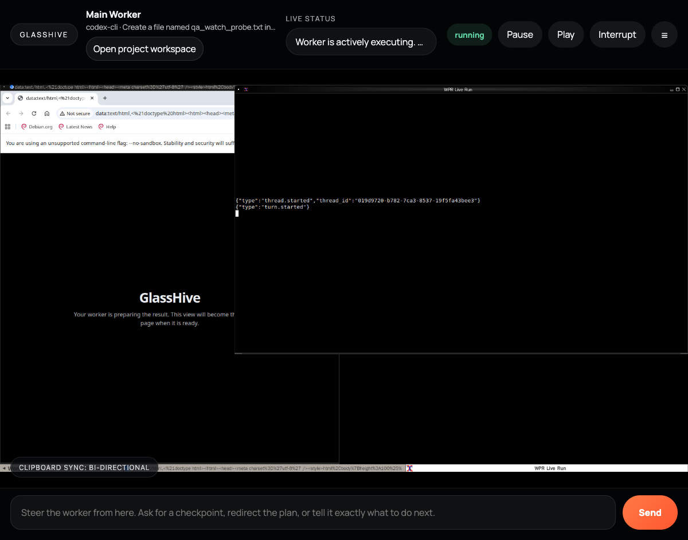
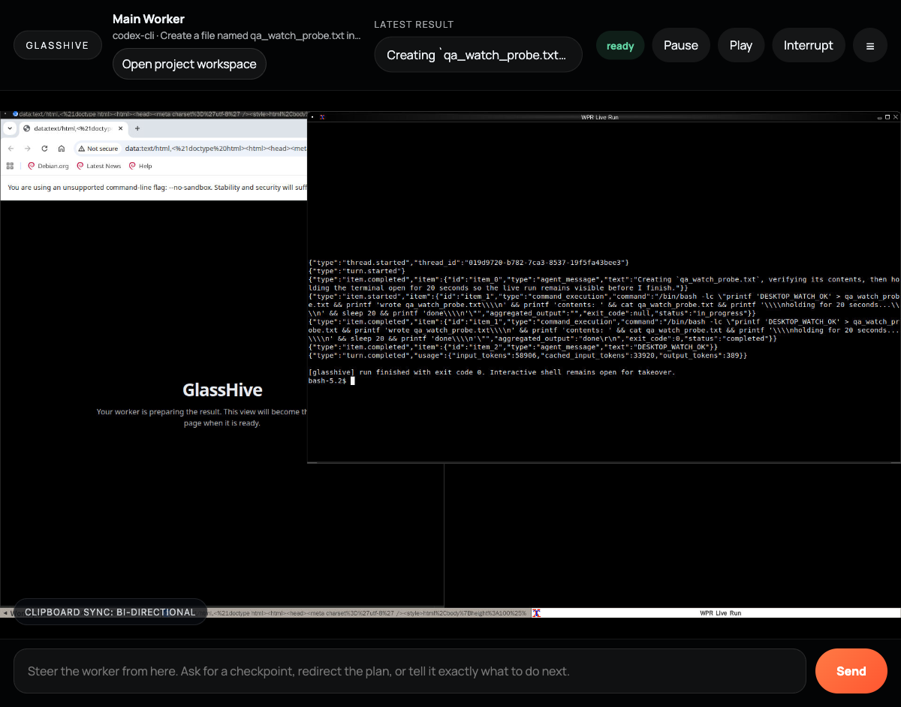

# GlassHive Watch Desktop QA

Date: 2026-04-16

## Scope

Validate the GlassHive launch/watch fixes for:

- desktop-first watch handoff
- visible live terminal inside desktop
- idle desktop priming instead of Selenium splash
- explicit launch-failed audit trail
- generated runtime env ownership for the new defaults

## Automated Coverage

Passed:

- `viventium_v0_4/GlassHive/frontends/glass-drive-ui/.venv/bin/python -m pytest -q`
- `viventium_v0_4/GlassHive/runtime_phase1/.venv/bin/python -m pytest -q`
- `viventium_v0_4/GlassHive/runtime_phase1/.venv/bin/python -m pytest tests/release/test_config_compiler.py -q`

Key assertions covered:

- launch UI defaults and explicit surface override
- terminal launch includes run-aware live-session attachment
- launch-failed endpoint marks worker failed and records `worker.launch_failed`
- idle desktop priming path is triggered on fresh containers
- compiler emits GlassHive launch env only when GlassHive is enabled

## Live QA

### 1. Runtime env ownership

Used the supported public path:

- `bin/viventium compile-config`

Observed in generated `runtime.env` for the enabled local install:

- `GLASSHIVE_DEFAULT_LAUNCH_SURFACE=desktop`
- `GLASSHIVE_SHOW_LIVE_TERMINAL_IN_DESKTOP=true`
- `WPR_IDLE_DESKTOP_PRIME_BROWSER=true`

### 2. Restarted live services

Used:

- `bin/viventium stop`
- `bin/viventium start`

Observed:

- GlassHive runtime healthy at `http://127.0.0.1:8766/health`
- GlassHive UI healthy at `http://127.0.0.1:8780`

### 3. Browser QA: launch flow

Used Playwright CLI against `http://127.0.0.1:8780`.

Observed before launch:

- the launch composer rendered normally
- Advanced defaulted to `Live desktop`

Observed after launching a new `codex-cli` worker project:

- redirect target was `/watch/...&surface=desktop`
- the watch page stayed on the desktop surface
- the watch page exposed `Open project workspace`

### 4. Browser QA: live desktop contents

Running-state screenshot:

Observed:

- left side showed the GlassHive placeholder Chromium window, not the Selenium Grid splash
- right side showed `WPR Live Run`
- terminal content was the actual live run stream, not a blank shell

Completed-state screenshot:

Observed:

- worker state moved to `ready`
- completed run output stayed visible in the desktop terminal window
- the watch header showed the latest result summary

### 5. Runtime/container cross-check

For the live QA worker:

- runtime API reported `worker.desktop_action` with note: `Opened the exact live worker terminal session inside the workstation desktop.`
- `wmctrl -l` inside the container showed:
  - a Chromium GlassHive placeholder window
  - a `WPR Live Run` xterm
- `screen -ls` showed the attached job session
- the workspace file created by the run existed
- after completion, runtime API showed:
  - run state `completed`
  - worker state `ready`
  - latest output ending in `DESKTOP_WATCH_OK`

### 6. Launch-failed path

Live API validation created a fresh worker, then posted a synthetic launch failure through:

- `POST /v1/workers/{worker_id}/launch-failed`

Observed:

- worker state became `failed`
- `last_error` matched the injected reason
- events contained `worker.launch_failed`

## Result

Pass.

The implemented behavior matches the intended GlassHive UX:

- desktop-first watch is now the default
- the real live worker terminal is visible inside the desktop
- fresh desktops no longer present Selenium branding as the primary surface
- failed launches are explicit and auditable instead of silent orphan workers

## Second Opinion

Host Claude CLI review-only pass completed after implementation and live QA.

Summary:

- confirmed the core behavior is aligned with docs
- flagged one cleanup item: compile the new GlassHive env vars only when GlassHive is enabled
- that cleanup was implemented and covered by release test coverage
