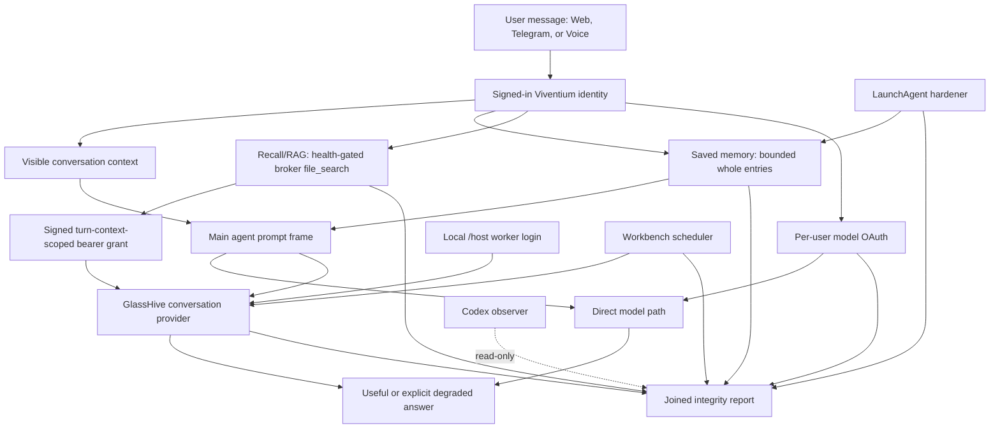

# Universal Cognitive Continuity And Auth Parity QA Run - 2026-08-09

## Summary

- Result: PARTIAL overall; every tested memory/recall/runtime path and cadence path under the
  explicit single-use migration contract passes, while one Test
  Account provider requires user reconnect, protected live Agent Builder drift remains intentionally
  unsynced, the next natural schema-v3 hardener receipt is pending, and fresh-install/release
  acceptance is still outside this run.
- Build/source under test: current local public checkout plus the active nested LibreChat checkout.
- Runtime/artifact under test: installed local-prod source/build activated from the current checkout;
  LibreChat API/web, Prompt Workbench, GlassHive, Telegram, and Modern Playground were live.
- Environment: local macOS development runtime with synthetic non-personal fixtures.
- Tester: Codex with real Browser, Playwright/Chrome, and Computer/Telegram paths; Claude review-only
  findings were used as an adversarial gate and dispositioned separately.
- Related change: structural continuity, broker parity, truthful connected-account health, memory
  route namespacing, schedule provenance, and GPT-5.6 memory-model selection.

This is not a one-entity fix. No production rule names the escaped incident entity or branches on a
user phrase. Frozen continuity bank `continuity-recall-v1.1.0` / `987dfffc5021ba69` contains 12
categories; together with the separate writer bank it spans relationships, preferences, project
state, corrections, dates, exact numbers, absent evidence, distractors, multilingual paraphrase,
ordinary phrasing, injection/noise rejection, tool ownership, and selective forgetting.

## Scope Run

| Case ID | Result | Evidence | Notes |
| --- | --- | --- | --- |
| `MEMCONT-007` | PASS | joined runtime checks plus live saved-memory and broker evidence | Cognitive evidence is available before prompting; unavailable evidence is explicit. |
| `MEMCONT-008` | PASS | 14/14 live family results: two same-thread controls plus 12/12 frozen GlassHive/main cases; 4/4 post-activation direct-provider cases | The frozen scoring contract spans distinct fact classes, ordinary language, injection/noise, and tool ownership; cleanup and preference restoration passed. |
| `MEMCONT-010` | PASS | real non-admin browser and native Telegram fresh-conversation recovery | Both used OpenAI/Luna medium under separate mapped identities and restored synthetic state. |
| `MEMCONT-011` | PASS | browser-visible `preferences` memory, canonical entry route, reload, cleanup | Saved-memory key no longer collides with the preferences control endpoint. |
| `MEMCONT-012` | PASS | real Chrome rename into a deleted destination plus persistence and degraded-context regressions | Tombstones cannot poison key reuse, revision stays monotonic, and store errors are not rendered as empty memory. |
| `MEMCONT-013` | PASS | real non-admin browser forced-primary-failure run, persisted structural event, reload, and cleanup | The configured fallback answered and the user saw and expanded “Model fallback used”; the disclosure survived reload. |
| `ACT-45` | PASS | real non-admin browser with disposable main Agent/cortex, failed cortex primary, configured fallback, persistence, reload, and cleanup | A fallback-produced Phase B result visibly and persistently identifies the fallback plus a public failure class. |
| `MCPOAUTH-004` | PASS/PARTIAL-ACCOUNT | real provider probe plus browser/API status before and after reload | Test Account OpenAI is usable; Anthropic was terminally rejected and now truthfully shows Disconnected. |
| `MCPOAUTH-006` | PASS | OpenAI/Anthropic terminal and transient failure tests | Terminal rejection persists reconnect state; 503 remains transient and does not create false reconnect. |
| `MEMHARD-014` | PASS | frozen 16-case bank repeated twice plus exact 500,000-character workpack | Luna/medium is the lowest-cost tier meeting the 100% mutation gate. |
| `MEMHARD-010` | PASS-CADENCE-TRANSITION | sole natural 03:00 schema-v2 launchd receipt, durable migration-closure/schema-v3 verifier tests, and joined integrity | The natural run advanced and used Luna/medium with the one accepted legacy parent proof. A second v2 or any v3 closes compatibility; the v3 observation survives receipt pruning, and new v3 receipts use absolute interpreter/launchctl paths plus exact PID agreement. The next natural v3 run is still to be observed. |
| Workbench nightly | PASS-CADENCE | refreshed real Browser UI, Scheduler/GlassHive/callback ledger, joined integrity | The natural 03:00 row is completed/scheduled with `xhigh -> xhigh`; evidence and current artifact passed; historical failures remain visible. |
| Modern Playground voice smoke | PASS-DELIVERY | real Chrome call/transcript/TTS/persistence/cleanup | One complete uncancelled TTS metric, one persisted assistant result, zero console errors; no human semantic-listening score was recorded. |
| Agent Builder source/live sync | PARTIAL-SAFE | [A/B/C review](2026-08-09-agent-sync-abc-review.md) reports 13 protected live-vs-source Agent differences | The config-driven recall prompt compiled with zero runtime/prompt-bundle drift; no broad Agent Builder sync overwrote user-managed tools, models, or prompts. |

## Natural User Use Case Checklist Run

| Use Case ID | Natural user action | Real surface used | Result | Visible evidence | Logs/DB/state/docs/artifact evidence | Remaining gap |
| --- | --- | --- | --- | --- | --- | --- |
| `MEMCONT-UC-010` | Ask for many kinds of prior evidence, including absent/corrected facts, ordinary operational language, injection/noise, and tool ownership. | GlassHive-backed main agent plus direct xAI voice-provider route | PASS | The complete live family passed 14/14, including 12/12 frozen cases, and the direct-provider cases passed 4/4. | Frozen bank version/hash, exact required/forbidden/tool contracts, broker/native tool events, run audit, preference restoration, and cleanup agreed. | Semantic judge was not used; deterministic contracts—not prose fluency—graded the cases. |
| `MEMCONT-UC-011` | Ask for prior evidence with recall disabled, then enabled. | authenticated LibreChat browser | PASS | Disabled path stated the limit; enabled path retrieved exact evidence and persisted after reload. | One brokered `file_search` on enabled path; zero native command substitution. | None for tested path. |
| `MEMCONT-UC-012` | Ask from Telegram under the mapped identity. | native Telegram Desktop | PASS | After `/reset`, the new answer recovered both synthetic fields. | New backend conversation had zero prior messages; Luna receipt and cleanup agreed. | None for tested path. |
| `MEMCONT-UC-013` | Store ordinary facts and recover them after a true conversation boundary. | non-admin browser and Telegram | PASS | Both surfaces recovered unrelated facts without repeating them. | Saved-memory revisions, read/writer receipts, model tuple, and exact cleanup agreed. | None for tested path. |
| `MEMCONT-UC-014` | Use a memory key that matches a settings control name. | browser chat, Memories panel, reload | PASS | `preferences` appeared as memory and was usable in a fresh chat. | Canonical `/entries/:key` client/API contract and restored revision proved no control-route collision. | None. |
| `MEMCONT-UC-015` | Rename a memory into a key whose prior generation was deleted. | real Chrome Memories edit dialog and reload | PASS | The renamed entry appeared at the destination and remained after reload with zero console errors. | Tombstone replacement used compare-and-swap semantics, revision increased monotonically, and disposable state was cleaned. | None for the tested path. |
| `MEMCONT-UC-016` | Send a normal turn while the configured primary model route is unavailable. | non-admin LibreChat browser | PASS | The fallback answer appeared with an expandable “Model fallback used” disclosure and both survived reload. | Persisted message contained the structural recovery event; primary failure, zero console errors, and exact fixture cleanup agreed. | None for the tested path. |
| `BACKGROUND-UC-012` | Trigger a background cortex whose primary model route is unavailable. | non-admin LibreChat browser | PASS | The fallback-produced cortex result showed “model fallback used”; expanded explanation and failure class survived reload. | Persisted `fallback_used` / `fallback_reason_class`, deliberately unavailable synthetic primary, configured fallback insight, zero console errors, and exact two-Agent/conversation/session cleanup agreed. | None for the tested path. |
| `MCPOAUTH-UC-006` | Inspect providers while `/host` remains healthy but one user grant is revoked. | Connected Accounts in real Chrome | PASS/PARTIAL-ACCOUNT | OpenAI showed Connected; Anthropic showed Disconnected before/after reload; zero console errors. | OpenAI model use succeeded; Anthropic refresh returned terminal `invalid_grant`; encrypted reconnect marker and API status agreed. | User must reconnect Anthropic. |
| `MEMHARD-UC-011` | Inspect overnight memory maintenance after its expected window. | CLI/integrity, LaunchAgent receipts | PASS-CADENCE-TRANSITION | Joined status is green. | The sole natural 03:00 schema-v2 run used Luna/medium and the single-use legacy parent proof; durable duplicate-v2/first-v3 closure, canonical executable resolution, schema-v3 exact-PID acceptance, and inconsistent-proof rejection passed. | Observe the next natural schema-v3 receipt. |
| Workbench nightly | Inspect the managed nightly after its expected window. | real Prompt Workbench Browser UI, integrity, Scheduler/GlassHive/callback ledger | PASS-CADENCE | After refresh, the latest row was `completed` / `scheduled run` at 03:00 with `xhigh -> xhigh`. | One active definition, completed natural row, evidence snapshot, passed current artifact, callbacks, and next occurrence agreed. | None for this cadence. |
| `MPV-014` | Run a post-change voice turn and verify delivered speech and persistence. | Modern Playground in real Chrome | PASS-DELIVERY | Call started, transcript and prompt were visible, and TTS completed without cancellation. | TTS metric, assistant persistence, call/session cleanup, and zero console errors agreed. | Audible waveform was generated/delivered by the browser path; no human semantic-listening score was recorded. |

## Traceability

`feature -> requirement -> use case -> QA case -> expected result -> actual evidence -> remaining gap`

- Feature: universal Viventium cognitive continuity across direct and GlassHive-backed surfaces.
- Requirement: `01_Key_Principles.md`, `20_Memory_System.md`,
  `32_Conversation_Recall_RAG.md`, and
  `51_GlassHive_Workflows_Self_Healing_and_Feature_Requests.md`.
- Use case: an ordinary user refers to earlier durable context from browser, Telegram, voice, or a
  GlassHive-backed main turn without restating it.
- QA case: `MEMCONT-007` through `MEMCONT-013`, `ACT-45`, `MEMHARD-010/014`, and
  `MCPOAUTH-004/006`.
- Expected result: the active route receives all authorized bounded evidence and declared tools;
  missing evidence or auth is explicit; no entity-specific rescue rule exists.
- Actual evidence: cross-domain matrices, fresh-conversation browser/Telegram runs, voice smoke,
  provider probes, saved-memory/API state, broker provenance, model receipts, and regression suites.
- Remaining gap or fix: Test Account Anthropic reconnect, intentional reconciliation of the 13
  protected Agent Builder drifts, observation of the next natural schema-v3 memory-hardener receipt,
  and clean release/fresh-install validation. Neither `/host`
  connectivity nor a passing OpenAI route can repair a revoked Anthropic user grant.

## Full-View Evidence Checklist

| Evidence surface | Required question | Result / sanitized pointer |
| --- | --- | --- |
| Requirement and use case | Which requirement, user case, and QA case is being proven? | Four owning docs and the case IDs above. |
| Code owning path | Which code path owns the behavior? | LibreChat memory agent/policy/routes, OAuth initializers, GlassHive broker/provider service, integrity module, scheduler, and hardener. |
| Docs and nested docs/repos | Which docs define expected behavior? | Root architecture/systems maps, memory/recall/GlassHive requirements, nested runtime architecture. |
| Scripts or harnesses | What exercised it? | memory-model eval, exact-provider matrix, saved-memory and main/background-fallback browser harnesses, account-health browser harness, voice harness, integrity command. |
| Local/external prerequisite state | What was proven healthy or degraded? | Local runtime, OpenAI user route, GlassHive host/companion, recall runtime healthy; Anthropic Test Account terminally rejected. |
| Logs | Which logs confirm or contradict? | Sanitized writer/read receipts, broker events, scheduler/run classes, TTS metrics, and provider failure class. |
| DB/state/persistence | What persisted? | Memory revisions, independent fresh conversations, encrypted reconnect marker, scheduler/run ledgers, voice assistant result; synthetic state cleaned. |
| Generated/shipped artifact | What artifact was inspected? | Compiled local runtime/prompt bundle and built packages were activated; prompt/runtime drift is zero. No public release or fresh clone was claimed. |
| Real user path | What was used like a user? | Browser chat/Memories/Settings/Prompt Workbench, native Telegram, Modern Playground voice, GlassHive main route. |
| Visual/UX comparison | Did UI match supporting truth? | Yes for saved memory and provider status; Anthropic correctly changed from false green to Disconnected. |
| Not run / blocked | What remains? | Test Account Anthropic reconnect, protected Agent Builder drift reconciliation, next natural schema-v3 receipt, fresh install, and release-wide acceptance. |

## Architecture And RCA



The escaped behavior was a chain, not one missing memory:

1. evidence could be absent from the bounded saved-memory snapshot and unavailable from recall;
2. recall capability/instruction delivery differed between direct, primary GlassHive, and fallback
   paths, allowing native discovery attempts or generic replies instead of authorized retrieval;
3. `/host` health was incorrectly treated as if it implied per-user provider/account health;
4. a decryptable credential row produced a false green even after the provider revoked its grant;
5. the saved-memory key `preferences` collided with a control route during mutation;
6. manual/off-window scheduler runs and obsolete model receipts could make maintenance look current;
7. a deleted destination generation could poison a later memory rename, while store failures could
   collapse into a misleading empty-memory context;
8. an expired broker grant could be relabeled as renewed without a newly signed authorization, and
   grant-mint failures could terminate a useful turn instead of degrading explicitly;
9. retrieved corrections were available, but one current-fact response repeated the rejected value;
10. earlier evidence concentrated on one incident entity and stale documentation repeated optimistic
    conclusions.

The aligned fix is structural: bounded complete memory exposure, fail-closed recall health,
provider-parity short-lived signed turn-context-scoped bearer grants without pseudo-renewal, shared
primary/fallback instruction delivery, outcome-backed credential status, collision-free and
tombstone-safe memory mutations, explicit degraded memory context and persisted main/background
model-fallback disclosure, tuple/provenance-aware schedule health, a provider-independent
current/final correction rule, cross-domain frozen evals, and joined observability. The main agent
is not forced to know what the system does not possess; the system maximizes authorized evidence
and names the exact missing plane when it cannot.

## User-Grade Evidence

- Surface exercised: LibreChat browser chat/Memories/Settings, Prompt Workbench, Telegram Desktop,
  Modern Playground, and GlassHive-backed main agent.
- Real user path: ordinary synthetic facts, fresh chat or `/reset`, unprompted recovery questions,
  settings inspection, reload, and a real voice call; a separate direct-provider API matrix is
  supporting parity evidence rather than a substitute for those user paths.
- Visible outcome: saved facts were recovered; diverse recall was exact; a tombstoned destination
  accepted a rename; account cards matched real provider state; the natural Workbench run was
  completed/scheduled; main and background-cortex fallbacks were visible; voice generated and
  persisted a response.
- Expanded/detail state: Memories panel, GlassHive activity/tool provenance, connected-account
  provider cards, Workbench recent runs/evidence/artifact detail, fallback reason, and linked voice
  transcript were inspected.
- Persistence/reload result: browser memory and rename, connected-account state, recall answer,
  fallback disclosure/answer, Workbench refresh, and voice assistant result survived their
  applicable reload checks.
- Local/external prerequisite state: OpenAI account, recall runtime, GlassHive host worker, and local
  app runtime were healthy. Anthropic Test Account was `auth/config missing` after provider
  `invalid_grant`, despite the credential row being decryptable.
- Evidence retrieval classification: enabled recall succeeded; disabled recall was an explicit
  unavailable capability, not a successful-empty result.
- Fallback path: primary/fallback worker capability parity was regression-tested. One real browser
  run forced a main-model primary failure; another activated a background cortex with a deliberately
  unavailable synthetic primary. Both received the configured fallback result, expanded the visible disclosure, reloaded
  it, matched persisted structural events, and cleaned their fixtures. No native filesystem
  substitution occurred in the live recall matrix.
- Backend/log/DB confirmation: sanitized receipts and state matched every visible pass; synthetic
  conversations, runs, call rows, and memory markers were removed or restored.
- Final model/runtime wording check: tested answers neither invented absent facts, repeated a
  superseded value in current/final answers, nor claimed tools or account connectivity that were
  unavailable.
- Substitution check: supporting logs, DB rows, API results, unit tests, and model output were not
  used in place of the real browser, Telegram, or voice paths.

## Automated Evidence

```bash
# Nested LibreChat focused suites
(cd viventium_v0_4/LibreChat/packages/api && npx -y jest@30.2.0 --runInBand --coverage=false \
  src/agents/__tests__/conversationRecallAvailability.test.ts src/agents/__tests__/memory.test.ts \
  src/agents/memory.spec.ts src/endpoints/anthropic/initialize.spec.ts \
  src/endpoints/openai/initialize.spec.ts src/memory/policy.spec.ts)
(cd viventium_v0_4/LibreChat/api && npx -y jest@30.2.0 --runInBand --coverage=false \
  server/routes/__tests__/connectedAccounts.spec.js server/routes/__tests__/mcp.spec.js \
  server/routes/__tests__/memories.spec.js server/routes/__tests__/memories.write.spec.js)

# Scheduling, prompt, memory, public-safety, and release contracts
python -m pytest tests/release/test_memory_hardening_contract.py \
  tests/release/test_memory_model_eval_harness.py tests/release/test_prompt_workbench.py \
  tests/release/test_prompt_architecture_eval_harness.py tests/release/test_prompt_registry.py \
  tests/release/test_no_runtime_nlu.py tests/release/test_qa_results_public_safety.py \
  tests/release/test_connected_accounts_onboarding_contract.py -q
python -m pytest tests/release/ -q

# Real local paths
node qa/memory-continuity/scripts/run-live-browser-saved-memory-qa.cjs
node qa/memory-continuity/scripts/run-live-browser-memory-rename-qa.cjs
VIVENTIUM_QA_ALLOW_LOCAL_JWT=1 \
  node qa/memory-continuity/scripts/run-live-browser-fallback-disclosure-qa.cjs
VIVENTIUM_QA_ALLOW_LOCAL_JWT=1 \
  node qa/background_agents/scripts/run-live-background-cortex-fallback-disclosure-qa.cjs
VIVENTIUM_QA_ALLOW_LOCAL_JWT=1 VIVENTIUM_EXPECT_OPENAI_STATUS=connected \
  VIVENTIUM_EXPECT_ANTHROPIC_STATUS=disconnected \
  node qa/connected-accounts-handoff/scripts/account_health_browser_qa.cjs
node qa/modern-playground-voice/scripts/tts_artifact_browser_qa.cjs
node qa/memory-continuity/scripts/run-provider-parity-matrix.cjs
bin/viventium cognitive-integrity --json
```

Results:

- memory/recall/provider package tests: 164/164 passing;
- broker/account/memory/client/background-cortex tests: 366/366 passing;
- saved-memory read/policy/availability focused tests: 95/95 passing;
- tombstone/revision memory methods: 12/12 passing;
- package API and data-schema builds: clean;
- prompt architecture/registry: 83/83 passing before the final generic tool-ownership refinement;
  the updated source/registry slice then passed 32/32;
- clean-App-Support bootstrap/status regression: 6/6 passing after canonical interpreter resolution;
- post-activation direct-provider continuity matrix: 4/4 passing with four native `file_search`
  completions, zero unexpected tools, restored recall preference, and exact fixture cleanup;
- Main/GlassHive continuity family: 14/14 live results, including 12/12 frozen deterministically
  graded cases, passing with zero retries;
- visible fallback recovery: failed primary, fallback answer, expanded disclosure, reload,
  persistence, zero console errors, and exact cleanup all passed; focused API fallback/pruning tests
  passed 34/34;
- background-cortex fallback provenance now survives completion payload, normal/resumable SSE,
  persistence, and expanded UI rendering; focused backend/client tests passed 43/43 and 13/13, and
  the real non-admin browser provider-failure path passed activation, fallback insight, expansion,
  reload, DB agreement, zero-console-error, and exact-cleanup gates;
- final focused memory-hardening/prompt-architecture/no-runtime-NLU slice: 137/137 passing; the run
  emitted temporary-directory cleanup warnings but no test failure;
- memory-hardening contract after durable single-use legacy closure and canonical
  interpreter/`/bin/launchctl` resolution: 80/80 passing;
- focused hardener/model/Workbench/prompt/connected-account/no-runtime-NLU/public-safety slice:
  333 passed and one isolated bootstrap failure, followed by the 6/6 fix verification above;
- full root release diagnostic: 1,192 passed, 8 skipped, 7 failed. One relevant obsolete
  provider-specific prompt assertion was replaced by the generic current-turn tool-ownership
  contract and reran green; the six remaining dirty-worktree watchdog/QA-catalog failures prevent a
  repository-wide release-ready claim.

## Model Decision

Frozen bank `memory-writer-v1.0.0`, hash `fc8acd04668038e3`, 16 cases repeated twice, strict gate
100% correct + 100% structured completion + zero policy-rejected operations:

| Route | Result | p50 | p95 | Observed credits | Decision |
| --- | ---: | ---: | ---: | ---: | --- |
| Sol/xHigh | 32/32 | 8.3 s | 15.9 s | 89.5746 | Passing control; unnecessarily costly for this lane. |
| Terra/high | 31/32 | 5.4 s | 8.0 s | 27.9723 | Ineligible: one exact mutation miss. |
| Luna/medium | 32/32 | 7.2 s | 9.6 s | 15.0418 | Selected: cheapest passing tier and better p95 than Sol. |

Luna/medium also passed the exact 500,000-character workpack 1/1 in 8.6 s with 161,229 input
tokens. The ceiling is an application safety limit, not a claim that long-context models reliably
use every token. Prompt Workbench deep reflection and observer tasks remain separate Sol/xHigh
workloads.

These are controlled observed results, not a statistical claim that Luna is universally smarter or
faster. The selection is valid only for this frozen writer bank and gate: Luna was the cheapest
passing tier, Terra was ineligible on correctness, and Sol was a more expensive passing control.
Subset runs validate the full frozen-bank hash but cannot select a winner, and the Anthropic fallback
was not part of this three-route comparison.

Official references used for the current model family and normalized cost ratios:

- [GPT-5.6 Sol, Terra, and Luna preview](https://help.openai.com/en/articles/20001325-a-preview-of-gpt-56-sol-terra-and-luna)
- [Codex rate card](https://help.openai.com/en/articles/20001106-codex-rate-card)

## Findings

- Defects: fixed broker instruction parity, expired-grant pseudo-renewal, broker mint-failure truth,
  stale process ownership, saved-memory route collision, tombstone rename poisoning, silent
  empty-memory degradation, terminal provider false green, transient/reconnect conflation,
  background capability loss during normalization, schedule provenance false green, hidden model
  fallback recovery, and corrected-evidence answer drift.
- Regressions: one client test and one release source-contract assertion encoded obsolete behavior;
  both now test the corrected contracts.
- Flakes: no live continuity case required a retry. The default floating Jest command resolved an
  incompatible 30.4.2 runtime against 30.2.0 helpers; exact 30.2.0 is green and the toolchain pin gap
  remains documented. A root-level invocation also selected the wrong JavaScript transform for the
  TypeScript package tests and collected zero tests; the same exact files passed 118/118 from their
  owning package directory.
- Environment issues: Test Account Anthropic requires reconnect. Thirteen protected live Agent
  Builder differences remain intentionally unsynced. The broad worktree contains unrelated
  uncommitted changes.
- Residual risks: provider/model updates require bank rerun; a missing/unrecorded/unauthorized fact
  remains unknowable; current local success is not public release, component-pin, or fresh-install
  proof; the next natural hardener run must produce the new schema-v3 exact-PID receipt.

## Independent Review

Claude Desktop / Opus 5 independently inspected the owning files and reproduced the key focused
suites. Its initial conditions drove the durable schema-v3 marker, canonical executable pinning,
bearer-grant wording, frozen tool-ownership case, and visible fallback-provenance repairs. After the
real background-cortex provider-failure browser acceptance and the environment-independent fixture
rerun, its final verdict was **APPROVE with no blockers for the scoped tested-local-path statement**.
It did not execute the installed runtime itself; that remains separate Codex/browser evidence.
See [the sanitized review record](2026-08-09-claude-opus5-universal-continuity-review.md).

## Public-Safety Review

- [x] No secrets, tokens, passwords, cookies, or credential-bearing command lines.
- [x] No private chats, prompts, attachments, screenshots with private content, personal emails, account identifiers, or customer data.
- [x] No conversation IDs, message IDs, session/call IDs, Telegram chat IDs, Mongo `_id` values, or raw provider request/response IDs.
- [x] No local absolute paths, hostnames, machine names, stack traces with private paths, DB exports, App Support state, or raw runtime dumps.
- [x] Private evidence is summarized with sanitized counts, hashes, timestamps, and conclusions only.
