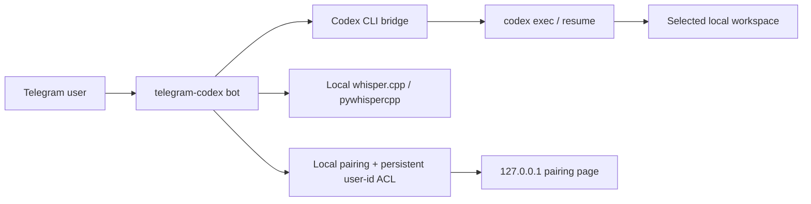

# telegram-codex

Local Codex, Telegram, and whisper.cpp in one clean loop.

`telegram-codex` is a standalone Telegram sidecar for working with local repositories from Telegram. It pairs one Telegram account through a localhost approval link, transcribes voice notes locally with `whisper.cpp` via `pywhispercpp`, and relays local Codex work back into the bot chat.

It is built to stay out of the way:

- separate Telegram bot token
- separate local runtime state
- durable machine-local pairing state scoped to the bot identity
- localhost-only pairing page
- no dependency on a running LibreChat instance
- per-chat project selection
- local Codex execution against real workspaces
- example-only tracked config for clean publishing

It can run two ways:

- directly from this folder with local `.env` and `config/*.yaml`
- through a Viventium install, using generated files under `~/Library/Application Support/Viventium/runtime/telegram-codex/`

## The loop

1. Send a text, voice note, photo, or document to your bot
2. Approve the account once through `127.0.0.1`
3. Pick a local project with `/use <alias>`
4. Let Codex work in that workspace
5. Read progress and final replies directly in Telegram

## What it does

- Receives Telegram text, voice notes, photos, and documents
- Transcribes voice notes locally with `pywhispercpp`
- Stages Telegram attachments inside the selected workspace so Codex can inspect them reliably
- Passes image attachments into Codex as image inputs when the CLI supports it
- Sends prompts to local `codex exec --json`
- Streams live preview updates from Codex JSONL events when available
- Relays cleaner progress updates and final answers back into Telegram
- Sends user-facing files back into Telegram when Codex lists them under an `Attachments:` section
- Maintains a per-chat Codex thread id for continuity
- Locks access to one paired Telegram user id after first local pairing and keeps that allowlist across restarts

## Security model

- Pairing happens over `127.0.0.1` only.
- After first pairing, the bot accepts only the paired Telegram user id.
- Logs, sessions, and pending pair links stay local and untracked.
- Approved pairings are stored in a durable machine-local file scoped to the bot identity, so restarts and runtime-profile changes do not force a re-pair.

Important limitation:

Telegram bots can identify the Telegram account, but not the specific client device.
So this project can lock to your Telegram account after a localhost approval step,
but it cannot prove that later messages came from one exact laptop client.

## Architecture



## Quickstart

### 0. What you need

- Python 3.11+
- [`uv`](https://docs.astral.sh/uv/)
- [`codex`](https://developers.openai.com/codex/)
- A Telegram bot token from BotFather
- At least one local project you want to expose through aliases

### 1. Create local config

```bash
cp .env.example .env
cp config/settings.example.yaml config/settings.yaml
cp config/projects.example.yaml config/projects.yaml
```

Fill in `.env` with your bot token and bot username:

```env
TELEGRAM_CODEX_BOT_TOKEN=your_bot_token
TELEGRAM_CODEX_BOT_USERNAME=your_bot_username
```

Then add one or more project aliases to `config/projects.yaml`.

### 2. Install dependencies

```bash
uv sync
```

### 3. Run tests

```bash
uv run pytest -q
```

### 4. Start the sidecar

```bash
uv run telegram-codex
```

### 5. Pair your Telegram account

1. Open your bot in Telegram and send `/start`
2. Open the localhost pairing link on the same machine running the sidecar
3. Return to Telegram and start chatting

## Viventium install path

If you are installing Viventium through the main setup flow, enable `integrations.telegram_codex` in the canonical config or wizard. The generated runtime files will land under:

- `~/Library/Application Support/Viventium/runtime/service-env/telegram-codex.env`
- `~/Library/Application Support/Viventium/runtime/telegram-codex/settings.yaml`
- `~/Library/Application Support/Viventium/runtime/telegram-codex/projects.yaml`

Pairing approvals are stored separately under the machine-local state tree, not under the per-profile runtime directory. That keeps an approved account paired even if the runtime profile or generated settings path changes.

## Commands

- `/start`
- `/projects`
- `/use <alias>`
- `/status`
- `/reset`
- `/pair`

## Docs

- [docs/SETUP.md](docs/SETUP.md)
- [docs/ARCHITECTURE.md](docs/ARCHITECTURE.md)
- [docs/SECURITY_MODEL.md](docs/SECURITY_MODEL.md)
- [docs/RELEASE_CHECKLIST.md](docs/RELEASE_CHECKLIST.md)

## Open-source posture

- MIT license
- tracked example config only
- runtime and secrets ignored
- community health files included
- tests included
- docs describe the actual security boundaries

## Good fit

- You want a private Telegram bot that can drive local Codex sessions
- You want voice-note input without sending audio to a hosted transcription API
- You want something that can live next to a larger stack without joining its runtime

## Not a promise this project makes

- It does not prove that a later Telegram message came from one exact physical device
- It does not replace Telegram account security
- It does not isolate Codex from the selected local workspace beyond the sandbox mode you choose
